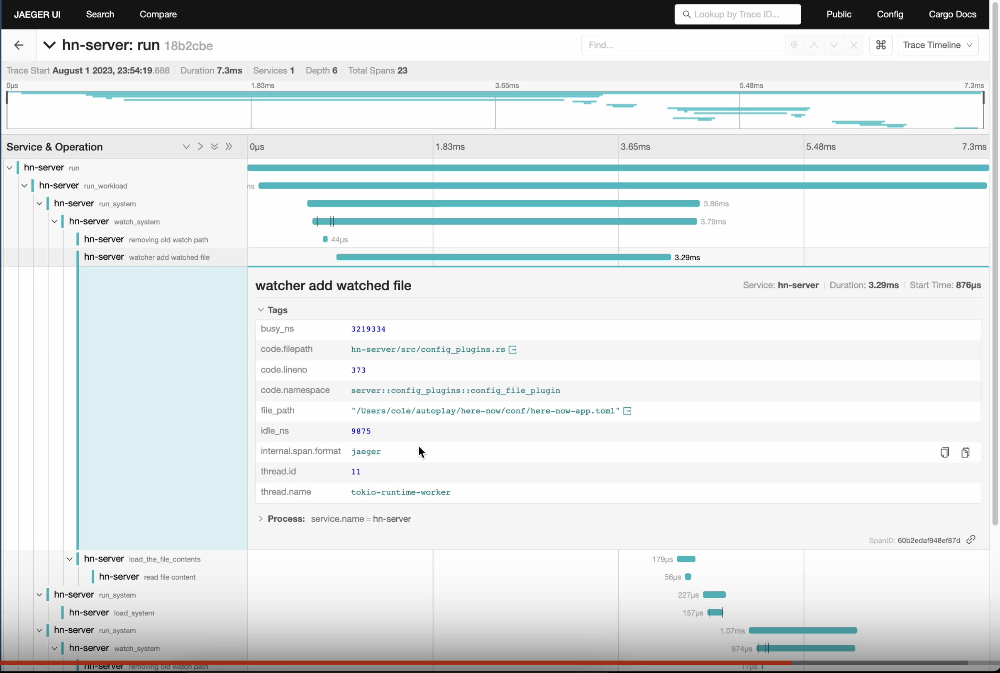

#  Here Now

Tentative plans for "Here Now".

I started working on my own light-weight version of a virtual office space like Tandem.chat, Remotion, or Tulip which is built on slint-ui with Rust and only implements the basic waving features.
I'm working on this for fun, and because I genuinely think I'd have more conversations with friends and collaborators if it was easier to connect, see who's online, and wave for help or to start a conversation.
With Tandem.chat (the platform I have the most experience with), I think it was a challenge to convince people to keep yet another Electron app open on their computer, so I'm going with technology that uses the minimum amount of resources possible while being cross-platform.

## Technology

**Front-end:**

- Slint-UI: Cross-platform desktop front-end with an innovative "Slint markup language"
  - As they are constantly improving slint, we'll probably talk with them some and contribute features like https://github.com/slint-ui/slint/pull/2557
- Rust for desktop app state management and binding to Slint-UI

**Back-end**

- Axum: Rust web server framework for general web serving and websockets
- Considering: [LiveKit](https://github.com/livekit/livekit) for live-streaming infra (leveraging their Rust SDK)

**Tooling**

- TypeScript/Deno/Bun for code generation and general purpose repo maintenance
- Git for version control
- Github for issue management

Anti-tech:

- No JS/HTML/CSS for front-end.
  - For now, I just don't want to add complexity of three additional languages for the front-end as I think it discourages additional contributors
  - I believe framing content in web-views will add complexity to distribution and add to the weight of the running application (where I want it to be super low-resources even if you're in a shared room).

## Who can help the most

- Anyone interested in designing and building UI interfaces in Figma & slint-ui (I can help teach you slint markup language, it's awesome!)

Are you interested in playing with slint-ui or very basic webservices for direct notifications?
Please open an issue introducing yourself or email me at cole@colelawrence.com

## Why open source?

I think people who have experienced Tandem.chat compared to Slack/Discord have a clearer understanding of the importance of this kind of tool for engineering teams.
But, I think the market is very difficult to penetrate since this kind of application is very difficult to explain the nuances of. So, let's just make it in public, share ideas, and make this kind of application for ourselves.

## Getting started

**Install watchexec** for watch commands like `cargo xtask dev` and `cargo xtask web-build --watch`.

```sh
cargo install watchexec-cli
```

**Get all the submodules** (we have several forks with smal tweaks so we can more easily upstream fixes as we build)

```sh
git submodule update --recursive --init
```

**Install node** ([I recommend using nvm](https://github.com/nvm-sh/nvm)) and then install the npm dependencies (these are for tailwind intellisense, prettier, and for a special launch-editor function from Jaeger).

```sh
npm install
```

**Install deno** ([installation](https://deno.land/manual@v1.35.3/getting_started/installation)). Deno is used for code generation and for as many non-cargo scripting things as we can manage, since it's much easier to maintain security of deno scripts than node scripts.

## Using Jaeger

Jaeger is a way for us to look at what's happening inside our application based on it's tracing spans.
This tooling greatly improves our ability to understand what happened and what is taking a long time to perform.


[See a recorded Loom: "2023-08-02 Here-Now Dev Tools with Jaeger UI"](https://www.loom.com/share/1cc6765cfe6046408d672da0520eed87)

### Using Jaeger locally

Install `jaeger-all-in-one` by adding [the binary from releases](https://github.com/jaegertracing/jaeger/releases/) to your `PATH`.

```sh
cargo xtask jaeger # in one terminal
cargo xtask dev-server # in the other
cargo xtask dev-desktop # in the other
```

### Using Jaeger in docker.

```sh
cargo xtask jaeger --docker # in one terminal
cargo xtask dev-server # in the other
cargo xtask dev-desktop # in the other
```

## Codebase structure

Utility crates:

- `hn-keys`: Simplified encryption tools for public/private key `LocalKeys`, `VerifiedMessage`, and `WireMessage`
- `hn-hinted-id`: A Serde, BonsaiDB, and Shipyard compatible prefixed XID.
- `hn-tracing`: Shared tracing/open-telemetry configuration between desktop, server, and xtask
- `hn-app`: Shared tools and helper types for importing and exporting data between Shipyard (ECS) and BonsaiDB. And helpers for a command cycle with BonsaiDB and Shipyard App with `AppCtx`.
- `hn-usr`: User displayed content types. Perhaps a starting point for internationalization (i18n).

### Desktop crates

- `hn-desktop`: Glues together the UI and Executor via message passing over a boxed trait to ensure the two halves of the desktop code can compile concurrently.
- `hn-desktop-ui`: Manages Slint windows and their state
- `hn-desktop-executor`: Maintains client application state such as key storage and server communication. Primarily, it's just the logic for communicating with the connected servers (and maybe it will be in charge of host operating system interaction?)
- `hn-desktop-ui-messages` (`ui`): The communication types shared between executor and ui. For example, it's types may be referenced as `ui::ToExecutor` and `ui::ToUI`.

## Server crates

- `hn-server`: The public server implementation for Here Now. This is where clients should be able to connect to to set up their profiles.
- `hn-public-api` (`api`): The communication types between executor and server. For example, it's types might be aliased like `api::Mutation`.

### Codebase maintenance

Tools for maintaining tidyness in the codebase.

- `xtask`: all codebase commands go through `cargo xtask ...` and those go to this executable.
  This allows us to write the majority of our code in Rust and cross-platform, including codebase management code. See [matklad/cargo-xtask](https://github.com/matklad/cargo-xtask).
- `workspace-hack`: A crate maintained by [hakari](https://docs.rs/cargo-hakari/latest/cargo_hakari/), updated by the `cargo xtask hakari` command.
